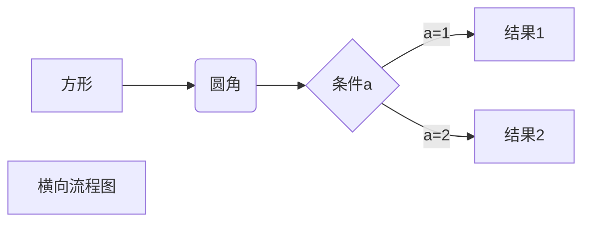
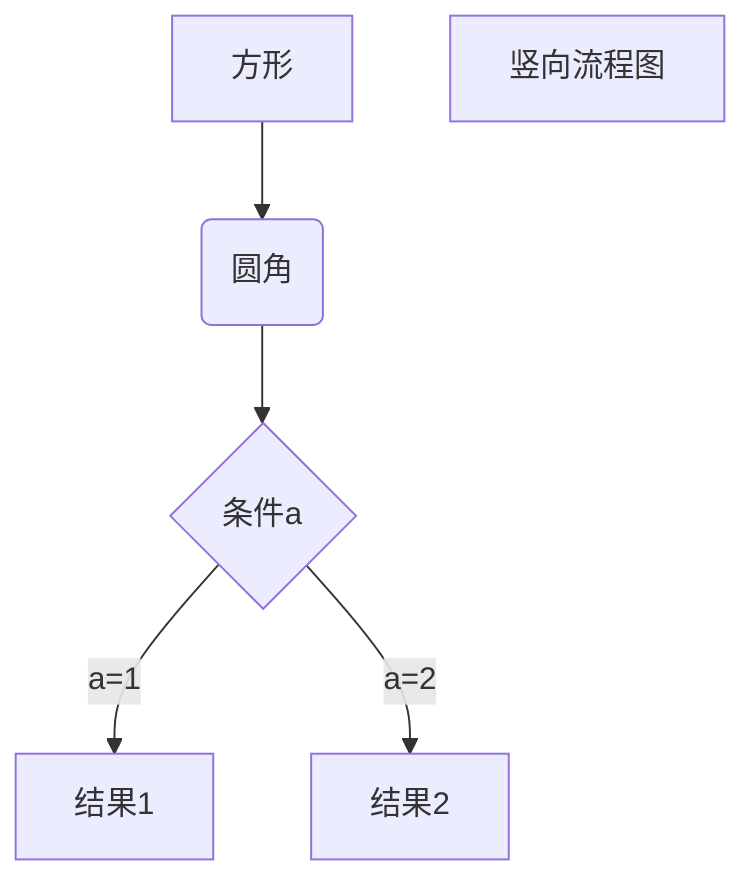
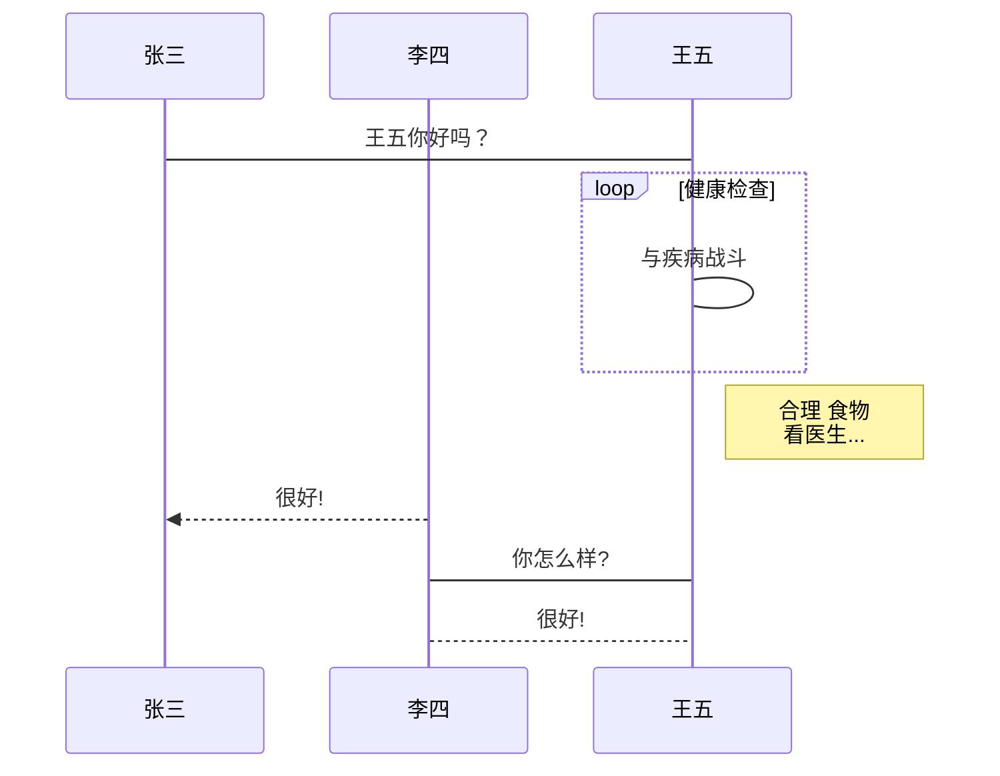
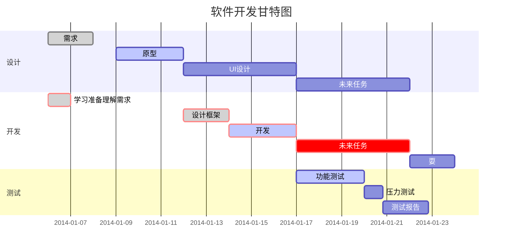

<!--MarkDown支持HTML注释-->
# <center> MarkDown Grammer Summery</center>


******** 
____ 
> ##### 1.Title Level
>> ###### TYPE 1
>>> # Level 1
>>> ## level 2
>>> ### level 3
>>> #### level 4
>>> ##### level 5
>>> ###### level 6
>> ###### TYPE 2
>>> level 1
>>> ======
>>> level 2
>>> ------

>##### 2.section
>> * br
>>> 使用一个换行符
>>> 末尾添加两个空格
>> * Font_Type
>>> *斜体*  _斜体_
>>> **粗体**  __粗体__
>>> ***粗斜体*** ___粗斜体___
>> * 分割线
>>> 使用、*、_任意三个以上建立分割线，不允许有其他内容，但是可以有空格
>>> 
>>> new line
>>> ****
>>> new line
>>> _____
>> * ~~删除线~~
>> * <u> 下划线 <u>
>> * 脚注[^note]
>>>  [^note]: 脚注有问题，不能定义变量，都是顺序按1开始
>>> 脚注2[^note2]
>>> [^note2]: 脚注test  

> ##### 3.list 列表
>>> 无序列表：使用+、*、_后面加一个空格
>> * ul
>> * ul
>> * ul
>>> 有序列表：使用1.2.3.后面加一个空格
>> 1. ol
>> 2. ol
>> 3. ol
>>> 嵌套列表：在子列表前加四个空格或制表符
>> 1. ol
>>  * ul
>>  * ul
>> 2. ol
>>  *ul
>>  *ul

> ##### 4.区块 block
>> block1
>>> block2
>>>> block3
>>>>> block4
>>>>>> block5
>>>>>>> block6
...

>##### 5.代码块
>> 函数块：`print`函数
>>> 代码块：代码块不能和区块嵌套 
``` python
    for i in range (10):
    print(i)
```

>##### 6. 链接
>>> 基本链接
>> * [连接名称]\(链接地址):以自定义名称的方式显示
>> [百度](https://www.baidu.com/)
>> * \<链接地址\>：以原文本的方式显示
>> <https://www.baidu.com/>
>>> 高级链接:
>> * 使用一个变量来设置一个链接，类似于脚注[链接名][脚注名]，脚注要放在文本最后
>> [百度][note]

>#### 7.图片
>> ![属性文本]\(图片地址)
>>> 
>>>
>> 加可选标题：![属性文本]\(图片地址 "可选标题")
>>> 
>>>
>MD不支持大小的修改，大小修改使用HTML的img标签
>> 

>#### 8.表格
>> |分割单元格
>> -分割表头和单元格
>> 在分割行用左右居中，:-,-:,:-:
>>|titleeee|titleeee|tieleeee|
>>|:-|-:|:-:|
>>|ti|ti|ti|
>>

>#### 9.进阶
>>* 支持HTML语法
>> <kbd>ctrl</kbd>+<kbd>shift</kbd>+<kbd>del</kbd>关机
>>* 支持转义
>>* 渲染数学表达式：
$fx = sin(x) + 12 $
$$\sum_{n=1}^{100} n$$
>>

##### 横向流程图

****
##### 竖向流程图

****
##### 标准流程图
```flow
st=>start: 开始框
op=>operation: 处理框
cond=>condition: 判断框(是或否?)
sub1=>subroutine: 子流程
io=>inputoutput: 输入输出框
e=>end: 结束框
st->op->cond
cond(yes)->io->e
cond(no)->sub1(right)->op
```
##### 标准流程图
```flow
st=>start: 开始框
op=>operation: 处理框
cond=>condition: 判断框(是或否?)
sub1=>subroutine: 子流程
io=>inputoutput: 输入输出框
e=>end: 结束框
st(right)->op(right)->cond
cond(yes)->io(bottom)->e
cond(no)->sub1(right)->op
```
##### UML时序图
```sequence
对象A->对象B: 对象B你好吗?（请求）
Note right of 对象B: 对象B的描述
Note left of 对象A: 对象A的描述(提示)
对象B-->对象A: 我很好(响应)
对象A->对象B: 你真的好吗？
```
##### UML时序图复杂
```sequence
Title: 标题：复杂使用
对象A->对象B: 对象B你好吗?（请求）
Note right of 对象B: 对象B的描述
Note left of 对象A: 对象A的描述(提示)
对象B-->对象A: 我很好(响应)
对象B->小三: 你好吗
小三-->>对象A: 对象B找我了
对象A->对象B: 你真的好吗？
Note over 小三,对象B: 我们是朋友
participant C
Note right of C: 没人陪我玩
```
##### UML标准时序图


##### 甘特图



****
[note]: https://www.baidu.com/